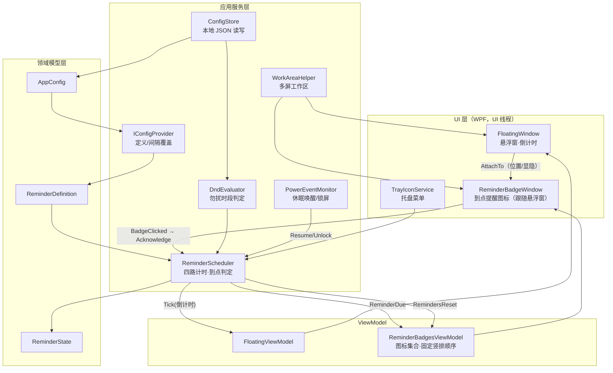
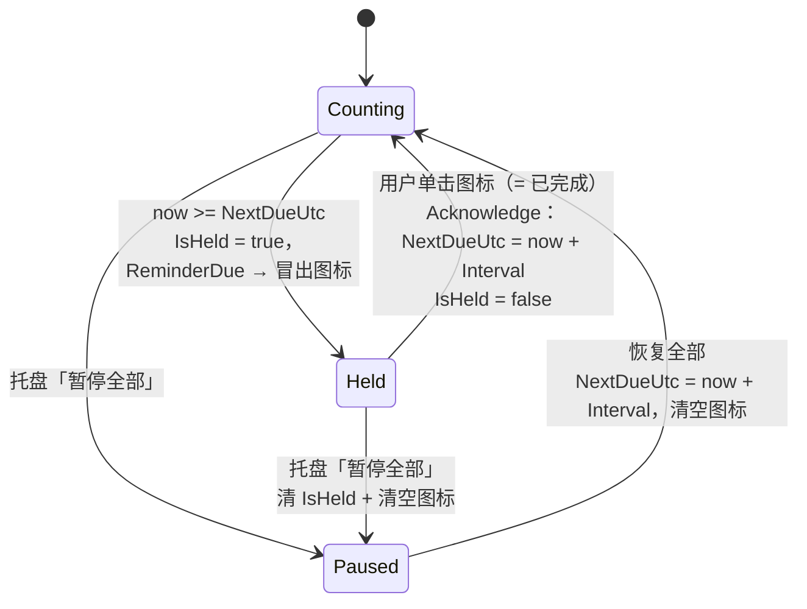

# Health Master 架构设计与实施方案（v1.1，现行）

> 面向 developer 的可执行方案。产品定位：Windows 11 桌面端健康提醒工具，后台常驻，
> 常驻小悬浮窗（always-on-top，可拖动，悬停显示四类提醒倒计时）+ 到点在悬浮窗旁**冒出提醒图标**（单击即完成）。
>
> 文档状态：**与 `src/HealthMaster/` 现行代码一致**，可直接作为实现基线。

---

### 版本演进说明（重要，勿回退）

| 版本 | 提醒形态 | 说明 |
|------|----------|------|
| v1 | 到点弹出**强提醒弹窗**（`ReminderPopupWindow` + `PopupQueue`，含贪睡、任务栏闪烁） | 已交付并实测 |
| **v1.1（现行）** | 到点在悬浮窗旁**冒出提醒图标**（`ReminderBadgeWindow`），左键单击即「已完成」 | 用户实测后明确反馈弹窗打断工作，**决策**取消弹窗 |

**v1.1 的变更是用户明确决策，不是疏漏。** 弹窗相关的 `Views/ReminderPopupWindow.*`、
`Services/PopupQueue.cs`、`NativeMethods.cs`（`FlashWindowEx`）**已从代码库删除**，贪睡（Snooze）
能力亦一并移除。后续任何 agent **不得**以「文档里写过」为由把弹窗 / 闪烁 / 抢焦点重新加回来
（见红线 6）。本文档保留上表仅为说明来龙去脉。

---

## 0. 硬性约束（红线，实现时不可突破）

1. **纯本地运行**：不联网、不上传、不接入任何第三方服务。（代码中不得出现任何网络请求/遥测/自动更新联网逻辑。）
2. **轻量低占用**：悬浮窗常驻，空闲 CPU 近 0%，内存尽量低。
3. **中文界面**：所有面向用户文本为简体中文，集中管理便于后续维护。
4. **平台**：Windows 11 桌面应用（x64）。
5. **交互形态**：常驻小悬浮窗（悬停显示倒计时）+ 到点在悬浮窗旁冒出提醒图标（单击即完成）。
6. **非打断式（v1.1 新增）**：不得使用弹窗、任务栏闪烁、`Activate()` 抢前台等任何打断用户当前工作的
   强提醒手段。**图标的出现与被点击都不得夺取焦点**（实现见 §8 的 `WS_EX_NOACTIVATE`）。

现行策略：**暂不开机自启、暂不加提示音**（结构上预留，见 §11）。

---

## 1. 技术栈选型

### 1.1 结论

| 维度 | 选择 |
|------|------|
| 语言 / 运行时 | **C# / .NET 8（LTS）** |
| UI 框架 | **WPF**（Windows Presentation Foundation） |
| 托盘图标 | **System.Windows.Forms.NotifyIcon**（.NET 内置，`<UseWindowsForms>true</UseWindowsForms>`，零第三方依赖） |
| 计时 | **DispatcherTimer**（UI 线程事件驱动）+ 绝对墙钟时间（wall-clock）判定到点 |
| 系统电源事件 | **Microsoft.Win32.SystemEvents.PowerModeChanged / SessionSwitch**（内置） |
| 多屏工作区 | **System.Windows.Forms.Screen**（.NET 内置，配合窗口 DPI 换算，见 §7.1） |
| 焦点控制 | **user32 P/Invoke**：`Get/SetWindowLong(Ptr)` 加 `WS_EX_NOACTIVATE`（内置，无第三方） |
| 配置存储 | **本地 JSON**（`%APPDATA%\HealthMaster\config.json`，`System.Text.Json`，原子写 + 损坏回退） |
| 打包 | `dotnet publish` 单文件 exe（详见 §13） |

**为什么是 C# / .NET 8 + WPF：**

- **原生 + 最贴合红线**：产品是 Windows 11 独占的常驻小工具，红线强调「轻量低占用」。.NET 原生桌面应用的常驻内存与 CPU 占用远低于 Electron，也优于常驻的 Python 解释器进程；always-on-top、无边框拖动、系统托盘、电源/会话事件、Per-Monitor DPI 等都是**一等公民 API**，无需拼装第三方库。
- **打包省事**：本机已安装 .NET 8 Desktop Runtime（8.0.27），既可打「依赖框架」的超小 exe，也可打「自包含」零依赖单文件 exe，一条 `dotnet publish` 命令搞定。
- **易维护**：强类型、成熟工具链（VS / VS Code + C# Dev Kit）、DispatcherTimer/数据绑定等对「倒计时 UI + 定时」这类场景是标准套路，长期可维护性好。
- **依赖极少**：托盘用 .NET 内置 WinForms NotifyIcon，配置用内置 `System.Text.Json`，多屏用内置 `System.Windows.Forms.Screen`，
  焦点控制用系统 user32 API，**实际做到零第三方 NuGet 依赖**（`HealthMaster.csproj` 无任何 `PackageReference`），符合「纯本地、可控」。

### 1.2 备选比较

| 方案 | 优点 | 缺点 | 结论 |
|------|------|------|------|
| **C# / .NET 8 + WPF**（选定） | 原生、低占用、Win11 API 齐全、打包简单、零第三方依赖；无边框透明窗 / `WS_EX_NOACTIVATE` / 多屏 DPI 等本项目重度依赖的能力都是一等公民 | 需装 .NET 8 **SDK**（已装，用户级）；团队需熟悉 C#/XAML | ✅ 采用 |
| **Python 3 + tkinter**（备选一） | tkinter 随 Python 内置、零 GUI 依赖、上手快；托盘可用 pystray | 常驻 Python 进程内存/启动相对偏重；PyInstaller 单文件体积大（数十 MB）、启动慢、需解压临时目录；UI 观感偏旧；本机 Python 3.14 过新，若日后想上 PySide6/PyQt 可能缺 wheel | 次选：若团队更熟 Python 可用，但在「轻量 + 原生观感 + 打包」上不如 WPF |
| **Tauri（Rust + WebView2）**（备选二） | 产物体积小、内存较低、前端可用 Web 技术 | 引入 Rust 工具链 + 前端构建，复杂度对「一个悬浮窗 + 几枚图标」偏高；依赖系统 WebView2 | 不采用：为极简小工具引入过重工具链 |
| **Electron** | 生态成熟、UI 灵活 | 常驻内存/体积巨大，**直接违反「轻量低占用」红线** | 否决 |

> **备注**：开发机 .NET 8 SDK 已就位，为**用户级安装**（`C:\Users\xiao\.dotnet`，8.0.423，非管理员权限），
> 使用前需把 `%USERPROFILE%\.dotnet` 加入 PATH。最终用户机只要有 .NET 8 Desktop Runtime 即可运行「依赖框架」版；
> 「自包含」单文件版则**无需**任何预装（现行分发形态，见 §13）。

---

## 2. 总体架构

分层：UI 层（悬浮窗 / 提醒图标窗 / 托盘）— 应用服务层（调度器 / 配置 / 勿扰 / 电源监听）— 领域模型层（提醒定义与状态）。UI 只订阅事件与绑定数据，不写业务逻辑。



**关键原则**

- **单一时钟源**：整个 App 只有一个 `DispatcherTimer`（1 Hz），驱动倒计时刷新与到点检查，避免多定时器抖动与忙轮询。
  提醒图标本身**不带任何动画循环或额外定时器**（悬停放大是纯 Trigger）。
- **绝对墙钟判定**：每个提醒记录 `NextDueUtc`（绝对时间），到点判断是 `now >= NextDueUtc`，**不靠累计 tick 计数**——这是正确处理系统休眠/唤醒的核心。
- **事件驱动 UI**：Scheduler 发三个事件——`Tick`（给悬浮窗刷新剩余秒数）、`ReminderDue`（冒出图标）、
  `RemindersReset`（清空全部图标），UI 层被动响应。
- **非打断**：所有提醒表达都在悬浮窗周边完成，进程**永不主动激活任何窗口**。

---

## 3. 模块划分

| 模块 | 职责 | 关键类型 |
|------|------|----------|
| 应用生命周期 | 单实例锁、启动/退出、托盘、异常兜底、悬浮窗定位与位置持久化 | `App.xaml.cs` |
| 领域模型 | 四类提醒的定义与运行时状态 | `ReminderType`、`ReminderDefinition`、`ReminderState`、`AppConfig`/`DndConfig` |
| 配置读写 | 本地 JSON 加载/原子保存/损坏备份回退、定向保存悬浮窗位置 | `ConfigStore` |
| 配置提供 | 提供四类定义（名称/间隔/文案/字形），应用间隔覆盖 | `IConfigProvider`、`DefaultConfigProvider` |
| 勿扰 | 夜间勿扰时段判定（支持跨零点） | `DndEvaluator` |
| 调度 | 四路独立计时、到点判定、勿扰抑制与补偿、暂停/重置、休眠唤醒 | `IReminderScheduler`、`ReminderScheduler` |
| 电源/会话监听 | 唤醒/解锁后立即重算 | `PowerEventMonitor` |
| 多屏工作区 | 取窗口所在屏幕的工作区（DIP），供悬浮窗与图标窗共用夹紧 | `WorkAreaHelper` |
| 悬浮窗 | always-on-top、拖动、悬停展开显示四路倒计时、位置跨重启记忆 | `FloatingWindow` + `FloatingViewModel` |
| **到点提醒图标** | 悬浮窗旁竖排冒出、不抢焦点、单击即完成 | `ReminderBadgeWindow` + `ReminderBadgesViewModel` + `ReminderBadgeItem` |
| 托盘 | 暂停/恢复全部、打开配置文件夹、退出 | `TrayIconService` |
| 文案资源 | 集中管理中文文本 | `Strings.cs` |

---

## 4. 文件 / 项目结构

```
HealthMaster/
├─ HealthMaster.sln
├─ README.md                          # 运行 / 打包说明
├─ publish/selfcontained/             # 自包含单文件成品 exe（见 §13）
├─ docs/
│  └─ ARCHITECTURE.md                 # 本文档
├─ src/
│  └─ HealthMaster/
│     ├─ HealthMaster.csproj
│     ├─ App.xaml
│     ├─ App.xaml.cs                   # 入口：单实例、托盘、DI-lite 组装、全局异常
│     ├─ app.manifest                  # Per-Monitor V2 DPI
│     ├─ Models/
│     │  ├─ ReminderType.cs            # enum：Sedentary/Eye/Water/Exercise
│     │  ├─ ReminderDefinition.cs      # ShortName/DisplayName/Interval/Body/Glyph（静态定义）
│     │  ├─ ReminderState.cs           # NextDueUtc/IsHeld/MissedDuringDnd（运行时状态）
│     │  └─ AppConfig.cs               # JSON 反序列化目标（含 DndConfig）
│     ├─ Services/
│     │  ├─ ConfigStore.cs             # 本地 JSON 读写（原子写 + 损坏备份回退）
│     │  ├─ IConfigProvider.cs
│     │  ├─ DefaultConfigProvider.cs   # 内置默认值 + 间隔覆盖
│     │  ├─ DndEvaluator.cs            # 勿扰时段判定（可跨零点）
│     │  ├─ IReminderScheduler.cs
│     │  ├─ ReminderScheduler.cs       # 核心调度
│     │  ├─ PowerEventMonitor.cs       # 电源/会话事件
│     │  ├─ WorkAreaHelper.cs          # 多屏工作区（Screen + DPI → DIP）
│     │  └─ TrayIconService.cs         # 托盘（图标运行时绘制，无 .ico 资源文件）
│     ├─ ViewModels/
│     │  ├─ FloatingViewModel.cs       # 倒计时可绑定数据（INotifyPropertyChanged）
│     │  ├─ ReminderBadgesViewModel.cs # 图标集合（ObservableCollection，固定竖排顺序）
│     │  └─ ReminderBadgeItem.cs       # 单枚图标的不可变可绑定数据
│     ├─ Views/
│     │  ├─ FloatingWindow.xaml/.cs
│     │  └─ ReminderBadgeWindow.xaml/.cs
│     └─ Resources/
│        └─ Strings.cs                 # 集中中文文案
```

> **已删除（v1.1，不得恢复）**：`Views/ReminderPopupWindow.xaml/.cs`、`Services/PopupQueue.cs`、
> `NativeMethods.cs`（`FlashWindowEx` 任务栏闪烁）。
>
> **无二进制资源**：托盘图标在 `TrayIconService.CreateIcon()` 中用 `System.Drawing` 运行时绘制；
> 四类提醒图标用系统字体 emoji 字形 + 彩色圆底，**不引入任何外部图片文件**（`Resources/Icons/` 目录不存在）。

> DI 说明：项目很小，**不引入 IoC 容器**；在 `App.OnStartup` 里手工 new 并串联各服务（DI-lite），保持依赖清晰即可。

### 4.1 csproj 关键配置

```xml
<Project Sdk="Microsoft.NET.Sdk">
  <PropertyGroup>
    <OutputType>WinExe</OutputType>              <!-- 无控制台窗口 -->
    <TargetFramework>net8.0-windows</TargetFramework>
    <UseWPF>true</UseWPF>
    <UseWindowsForms>true</UseWindowsForms>       <!-- 仅为 NotifyIcon 与 Screen -->
    <Nullable>enable</Nullable>
    <LangVersion>latest</LangVersion>
    <ApplicationManifest>app.manifest</ApplicationManifest> <!-- Per-Monitor DPI -->
    <SatelliteResourceLanguages>zh-Hans</SatelliteResourceLanguages>
    <NoWarn>$(NoWarn);WFAC010</NoWarn>
  </PropertyGroup>
</Project>
```

两处易踩的坑，改动 csproj 时注意：

- **不启用 `ImplicitUsings`**：WPF + WinForms 同时开启会注入互相冲突的全局 using（如 `Application`），
  故全部改为显式 `using`，并在需要处用别名（如 `using Screen = System.Windows.Forms.Screen;`）。
- **抑制 `WFAC010`**：该告警要求用 WinForms 的 `ApplicationHighDpiMode`，但本应用没有 WinForms 窗体、
  DPI 由 manifest 的 Per-Monitor V2 声明生效，故显式抑制（保持 0 警告构建）。

`app.manifest` 需声明 **Per-Monitor V2 DPI 感知**（Win11 多屏 + 缩放下悬浮窗不糊、坐标正确）：

```xml
<application xmlns="urn:schemas-microsoft-com:asm.v3">
  <windowsSettings>
    <dpiAwareness xmlns="http://schemas.microsoft.com/SMI/2016/WindowsSettings">PerMonitorV2</dpiAwareness>
  </windowsSettings>
</application>
```

---

## 5. 核心数据模型

```csharp
// Models/ReminderType.cs
public enum ReminderType { Sedentary, Eye, Water, Exercise } // 久坐/护眼/补水/运动

// Models/ReminderDefinition.cs —— 静态定义（来自配置提供者）
public sealed record ReminderDefinition(
    ReminderType Type,
    string       ShortName,     // 悬浮窗紧凑标签，如 "护眼"
    string       DisplayName,   // 完整名称，如 "护眼提醒"（图标 tooltip 首行）
    TimeSpan     Interval,      // 提醒间隔
    string       Body,          // 一句可执行建议（图标 tooltip 第二行）
    string       Glyph);        // 提醒图标字形（emoji，无外部图片文件）

// Models/ReminderState.cs —— 运行时状态（每类一份，可变）
public sealed class ReminderState
{
    public ReminderType Type { get; init; }
    public DateTime NextDueUtc { get; set; }      // 绝对到点时间（UTC 墙钟）
    public bool IsHeld { get; set; }              // 图标已挂出、等待用户单击期间挂起，防重复触发
    public bool MissedDuringDnd { get; set; }     // 勿扰内被抑制，结束后补偿一次
    public TimeSpan Remaining(DateTime nowUtc) =>
        NextDueUtc > nowUtc ? NextDueUtc - nowUtc : TimeSpan.Zero;
}

// Models/AppConfig.cs —— 本地 JSON（%APPDATA%\HealthMaster\config.json）
public sealed class AppConfig
{
    public int SchedulerVersion { get; set; } = 1;
    public Dictionary<string, int> IntervalMinutes { get; set; } = new(); // 键为 ReminderType 名，如 "Eye"
    public double? FloatingX { get; set; }        // 悬浮窗上次位置（跨重启记忆）
    public double? FloatingY { get; set; }
    public DndConfig DoNotDisturb { get; set; } = new();
}

public sealed class DndConfig
{
    public bool   Enabled { get; set; }            // 默认 false，需用户手改为 true
    public string Start   { get; set; } = "22:00"; // 本地时间 "HH:mm"
    public string End     { get; set; } = "07:00"; // 可跨零点
}
```

> **命名说明**：`ReminderState` 的挂起标志叫 `IsHeld`（v1 曾叫 `IsPaused`）——「全局暂停」是
> Scheduler 内部的 `_globalPaused`，与单类挂起是两回事，分开命名避免混淆。
> `ReminderDefinition` 原有的 `Title` 字段（以及 `Strings.*Title`）在 v1.1 随弹窗一起删除，
> 图标 tooltip 首行改用 `DisplayName`。

**配置抽象**

```csharp
public interface IConfigProvider
{
    IReadOnlyList<ReminderDefinition> GetDefinitions(); // 四类定义
}
```

`DefaultConfigProvider` 返回四条内置 `ReminderDefinition`（数值/文案见 §12），并在构造时接收
`AppConfig`：若 `IntervalMinutes` 里有该类的正数覆盖值则采用之，否则用内置默认。
**「可配置」的接缝留在 `IConfigProvider`，加设置界面时只需改这一层，无需动调度与 UI。**

---

## 6. 调度机制（核心：防忙轮询 + 休眠唤醒）

### 6.1 单时钟 + 绝对时间

- App 启动时，为四类各建一个 `ReminderState`，`NextDueUtc = UtcNow + Interval`。
- 一个 `DispatcherTimer`（`Interval = 1s`）驱动一次 `Evaluate(nowUtc, nowLocal)`：
  1. 全局暂停时跳过全部到点逻辑；
  2. 判定勿扰状态，处理「刚进入 / 刚结束」两个边沿（见 §6.5）；
  3. **到点检查**：遍历四类，凡 `!IsHeld && nowUtc >= NextDueUtc` → 置 `IsHeld = true`（挂起，避免图标未被点击时重复触发），
     并按是否在勿扰内决定「触发 `ReminderDue(type)` 冒图标」还是「只打 `MissedDuringDnd` 标记」；
  4. 最后触发 `Tick(nowUtc)`，由 `App` 转给 `FloatingViewModel`（**仅当悬浮窗可见时才更新**，减少无谓计算与渲染）。

> **为何不忙轮询**：1 Hz 的 DispatcherTimer 是系统消息驱动，空闲时 CPU 近 0；不使用 `while`/`Thread.Sleep` 轮询。1 秒粒度对「分钟级健康提醒」完全够用。

> **为何不用四个定时器**：四路合并到一个时钟，逻辑集中、无多定时器漂移；每路的差异只体现在各自的 `NextDueUtc` 上。

> **注意**：勿扰判定必须用**本地时间**（`DateTime.Now`），到点判定必须用**UTC**（`DateTime.UtcNow`），
> 故 `Evaluate` 同时接收两个时间参数，不要在内部各取各的。

### 6.2 到点 → 冒图标 → 单击完成 → 重置 的状态机



- **单击即完成即重置**：`Acknowledge(type)` 把 `NextDueUtc = UtcNow + Interval`、`IsHeld = false`、
  `MissedDuringDnd = false`，重新计时。**没有贪睡（Snooze）**——v1 的「稍后 5 分钟」按钮已随弹窗一并删除。
- **图标挂着期间不重复**：`IsHeld = true` 保证同一类不会再冒出第二枚图标。
- **不点则一直挂着**：图标不自动消失、不超时、不升级为任何更强的提醒。这是「非打断」的核心体现。
- **暂停必须清标记**：`PauseAll()` 在清空图标（`RemindersReset`）的同时，必须把各类的 `IsHeld` /
  `MissedDuringDnd` 一并清掉，否则 UI 已无图标而模型仍认为「挂着」，恢复后该类会永远不再提醒。

### 6.3 休眠 / 唤醒 / 锁屏处理

因为用**绝对墙钟**判定，休眠期间不推进计时；唤醒后：

- 正常路径：下一次 `Evaluate` 发现 `nowUtc >= NextDueUtc`，自然触发（可能一次唤醒后立刻到点）。
- 加速路径：`PowerEventMonitor` 订阅 `SystemEvents.PowerModeChanged`（`Resume`）与 `SessionSwitch`（`SessionUnlock`），
  事件到达时通过 `Dispatcher.BeginInvoke` 编组回 UI 线程调用 `RecalculateNow()`（等价于一次 `Evaluate`），不必等下一秒。
  **注意**：这两个系统事件在专用线程触发，直接碰 UI 对象会炸，必须编组。
- **补偿策略（防「唤醒即连环提醒」）**：睡眠跨越多个周期时**不补发多次**——`IsHeld` 天然保证同一类只冒一枚图标；
  用户单击后才 `NextDueUtc = UtcNow + Interval` 对齐到当前。即「错过就当此刻到点，只提醒一次」。

```csharp
// 伪代码要点（对应 ReminderScheduler.Evaluate）
void Evaluate(DateTime nowUtc, DateTime nowLocal) {
    if (!_globalPaused) {
        bool inDnd = _dnd.IsInWindow(nowLocal);
        // …… 勿扰边沿处理见 §6.5 ……
        foreach (var s in _states) {
            if (s.IsHeld) continue;                 // 图标挂着期间不重复触发
            if (nowUtc >= s.NextDueUtc) {
                s.IsHeld = true;
                if (inDnd) s.MissedDuringDnd = true;   // 勿扰内抑制，稍后补一次
                else       RaiseReminderDue(s.Type);   // 冒出图标
            }
        }
    }
    RaiseTick(nowUtc);   // 悬浮窗刷新（App 层再判断是否可见）
}
```

### 6.4 多类同时到点：图标竖排

- 多类同时到点时，各自的图标**从上到下竖排成一列**，可分别独立点击完成，互不阻塞。
  （v1 的「弹窗排队逐个弹」已废弃：图标天然可以并存，无需排队。）
- 竖排顺序由 `ReminderBadgesViewModel.Order` 写死为 **护眼 → 久坐 → 补水 → 运动**，
  与悬浮窗展开态的行序一致。新图标按该顺序**插入**到正确位置（`InsertIndexFor`），
  而非追加到末尾——这样无论到点先后，图标位置都是稳定的，用户形成肌肉记忆后不会点错。

### 6.5 夜间勿扰时段（DndEvaluator）

`DndEvaluator.IsInWindow(localNow)` 用本地时间判定，支持跨零点区间（如 22:00 → 07:00）；
`Enabled=false` 或起止时刻相同或格式非法时一律视为不在勿扰内（宁可提醒也不静默失效）。

Scheduler 用 `_wasInDnd` 记住上一拍状态，识别两个边沿：

| 边沿 | 行为 |
|------|------|
| **刚进入勿扰**（`!_wasInDnd && inDnd`） | 把所有 `IsHeld` 的类标记 `MissedDuringDnd = true`，并触发 `RemindersReset` **清空屏幕上残留的图标**——勿扰期间不该有任何提醒可见 |
| **勿扰期间到点** | 只置 `IsHeld` + `MissedDuringDnd`，**不冒图标** |
| **刚结束勿扰**（`_wasInDnd && !inDnd`） | 遍历 `MissedDuringDnd` 的类，各**补偿冒出一次**图标并清掉该标记（按类只一次，不按错过周期数连环冒） |

`Start()` 与 `ResumeAll()` 都会用当前时间重新初始化 `_wasInDnd`，避免刚启动/刚恢复就被误判为「刚进入」或「刚结束」。

---

## 7. 悬浮窗实现（FloatingWindow）

**目标**：小、always-on-top、可拖动摆放、默认紧凑，鼠标悬停展开显示四路倒计时。

XAML / 窗口属性要点：

- `WindowStyle="None"`、`AllowsTransparency="True"`、`Background="Transparent"`、`ResizeMode="NoResize"`、
  `ShowInTaskbar="False"`、`Topmost="True"`、`SizeToContent="WidthAndHeight"`、`WindowStartupLocation="Manual"`。
- 圆角卡片用 `Border CornerRadius="10"`；半透明背景（`#E6202020`）提升观感、降低遮挡感；`MinWidth="118"` 防止折叠态过窄跳动。
- **拖动**：窗体 `MouseLeftButtonDown` 里调用 `this.DragMove()`（阻塞至松手），返回后回调 `PositionChanged(Left, Top)` 供上层持久化。
  `DragMove` 在鼠标捕获丢失时会抛 `InvalidOperationException`，需 catch 忽略。
- **悬停展开**：折叠态显示「最近一项」，展开态显示四行倒计时。用绑定到
  `Window.IsMouseOver` 的 `DataTrigger` 切换两块面板的 `Visibility`，**不写 code-behind、不加动画**。
- **倒计时绑定**：`FloatingViewModel` 暴露 `Eye/Sedentary/Water/Exercise/Compact` 五个 `string`，
  实现 `INotifyPropertyChanged`（`Set` 里带相等判断，值未变不触发通知，省掉大量无谓渲染）；
  由 Scheduler 的 `Tick` 驱动更新，且 `App` 侧只在 `_floating.IsVisible` 时才调用 `Update`。
- **「待完成」而非 00:00（v1.1）**：某类图标正挂着（`IsHeld`）时，它没有「下一次」可倒数，
  显示 `00:00` 会误导用户以为卡死。故：
  - 展开态该行显示 `Strings.HeldLabel`（「待完成」）；
  - 折叠态挑「最近一项」时**必须跳过 `IsHeld` 的类**，否则其恒为 0 的剩余时间会把折叠态永久锁死在 `00:00`；
  - 四类图标全挂着时，折叠态显示「待完成」。
- **保持置顶**：极少数场景 Topmost 会被其他全屏程序压过；依赖 `Topmost=true` 即可，不做额外 hack（可选增强）。
- **位置**：跨重启记忆已实现（`AppConfig.FloatingX/Y`）。首启放屏幕右下角安全区（`WorkArea.Right-170, Bottom-70`）；
  `Loaded` 后按 §7.1 夹紧到工作区内，避免记忆位置因分辨率/接屏变化落到屏幕外。

倒计时文本格式：`mm:ss`（<1h）或 `H:mm:ss`（≥1h）。到点前不做特殊色变，后续可加「临近高亮」。

### 7.1 多屏工作区夹紧（WorkAreaHelper）

`SystemParameters.WorkArea` **只返回主屏**的工作区。若悬浮窗被用户拖到副屏，用它夹紧会把窗口
（以及跟随的图标窗）粗暴拽回主屏。故统一改用 `WorkAreaHelper.For(window)`：

1. 取窗口的 `CompositionTarget`（拿不到说明尚未有句柄，退回 `SystemParameters.WorkArea`）；
2. 用 `TransformToDevice` 把窗口中心点从 DIP 换算到物理像素；
3. `Screen.FromPoint(中心点)` 定位所在屏幕，取其 `WorkingArea`（物理像素）；
4. 用 `TransformFromDevice` 把工作区矩形换算回 DIP 返回。

**第 2/4 步的 DPI 换算不可省**：`Screen.WorkingArea` 是物理像素，WPF 的 `Left/Top` 是 DIP，
在非 100% 缩放的屏幕上直接混用会算出错误位置。`App.ClampToWorkArea` 与
`ReminderBadgeWindow.UpdatePlacement` **共用**此 helper，保证两窗判断的是同一块屏幕。

---

## 8. 到点提醒图标（ReminderBadgeWindow）—— v1.1 的核心改动

**目标**：看得见但**不打断**。到点时在悬浮窗旁竖排冒出一枚彩色圆形图标，左键单击即表示该类
「已完成」，图标消失并重置计时；不点则一直挂着，不自动消失、不升级为任何更强的提醒。

> **为什么不是弹窗**：v1 的强提醒弹窗会抢焦点、打断正在进行的输入，用户实测后明确要求取消。
> 红线 6 已固化此决策。任何形式的弹窗、任务栏闪烁、`Activate()` 抢前台都不得再出现。

### 8.1 为什么是一个独立窗口，而不是塞进悬浮窗内部

图标窗（`ReminderBadgeWindow`）是**独立的无边框透明 Topmost 窗**，通过 `AttachTo(anchor)` 跟随
悬浮窗的位置 / 尺寸 / 显隐。

**刻意不把图标做成悬浮窗内部的一块面板**：悬浮窗用 `SizeToContent="WidthAndHeight"`，
其 `Left/Top` 就是位置持久化（`AppConfig.FloatingX/Y`）的语义基准。若图标在悬浮窗内增减，
窗口尺寸会随之变化，进而牵动 `Left/Top` 的视觉含义与保存值，破坏「位置跨重启记忆」的正确性。
拆成两个窗口后，悬浮窗的尺寸与位置语义完全不受提醒影响。

### 8.2 窗口属性（`ReminderBadgeWindow.xaml`）

| 属性 | 值 | 原因 |
|------|----|------|
| `WindowStyle` / `AllowsTransparency` | `None` / `True` | 无边框、圆形图标需透明 |
| `Background` | **`{x:Null}`** | 空背景**不参与命中测试**，圆形图标之外的窗口矩形对鼠标完全穿透。**不可用 `Transparent`**——它参与命中测试，会吞掉落在空白区的点击 |
| `Opacity` | 初始 `0` | 首帧门控：定位算完后由代码置 `1`，避免在屏幕左上角闪一帧 |
| `ShowInTaskbar` / `ShowActivated` | `False` / `False` | 不占任务栏、显示时不激活 |
| `Topmost` | `True` | 与悬浮窗一致 |
| **`Width`** | **写死 `46`** | 见 §8.3，**勿改为自适应** |
| `SizeToContent` | **`Height`**（仅高度） | 高度随图标数自适应 |

### 8.3 【设计决策】宽度写死 46，`SizeToContent` 只开 Height

`46 = 图标 36 + 左右 Margin 各 5`。

**不要改成 `SizeToContent="WidthAndHeight"`。** 原因：无边框窗口的宽度自适应会被系统的
**最小跟踪尺寸（min-track，`SM_CXMINTRACK`）** 钳制，首帧被撑到 130+ DIP，且此后**不再收敛**回内容宽度。
`UpdatePlacement` 用 `ActualWidth` 计算左侧贴靠位置，宽度虚高会让图标明显偏离悬浮窗。
高度方向不受该限制，故仍可自适应。这是实测后的刻意取舍，改动前请先复现该现象。

> 推论：若将来调整图标直径或 Margin，**必须同步手改这个 46**，否则图标会偏位。

### 8.4 【设计决策】不抢焦点：`WS_EX_NOACTIVATE`

`ShowActivated="False"` 只保证「显示时」不激活；**用户点击图标时仍会激活本窗**，把用户正在输入的
窗口踢掉焦点——这直接违反红线 6。

故在 `OnSourceInitialized` 里给窗口追加扩展样式 `WS_EX_NOACTIVATE (0x08000000)`：窗口永不接受激活，
但照常接收鼠标消息，`Button.Click` 正常触发。

- 用 user32 的 `GetWindowLong/SetWindowLong`（用的是系统 API，**不引入第三方依赖**）。
- 64 位用 `*WindowLongPtrW`，32 位用 `*WindowLongW`（32 位 user32 未导出 `*LongPtrW`），按 `IntPtr.Size` 分流。
- 按钮样式里设 `Focusable="False"`，避免焦点视觉残留。

### 8.5 【设计决策】图标增减必须延后到下一轮 Dispatcher

`ReminderBadgeWindow` 对 `ObservableCollection.CollectionChanged` 的订阅**早于** `ItemsControl` 内部的订阅。
若在该回调里**同步**调用 `UpdatePlacement()`（内含 `Show()` 与布局），会在 `ItemsControl` 尚未处理完这条
`Add` 通知时重入其容器生成器，导致同一项被生成两次——**屏幕上会多出一枚重复图标**
（实测曾出现 items=4 而生成 5 个 Button）。

正确做法：用 `Dispatcher.BeginInvoke(DispatcherPriority.Loaded, …)` 把重定位推迟到本轮布局之后，
并用 `_placementQueued` 标志合并同一轮内的多次增减，只排一次。

> **注意区分**：只有**集合变更**触发的重定位需要延后。**锚点移动（`LocationChanged`）与自身尺寸变化
> （`SizeChanged`）仍是同步处理**——拖动悬浮窗时图标必须跟手，延后会肉眼可见地拖影。

### 8.6 定位逻辑（`UpdatePlacement`）

1. 无图标（`Items.Count == 0`）或锚点不可见 → `Opacity = 0` 后 `Hide()`（置 0 是为了下次显示重新走首帧门控）。
2. 需要显示但当前隐藏 → 先 `Opacity = 0` 再 `Show()`（`ShowActivated=False`，不抢焦点）。
3. `ActualWidth/Height <= 0` 说明布局未完成，直接返回——`SizeChanged` 会再来一次。
4. 取 `WorkAreaHelper.For(_anchor)`（**锚点所在屏幕**的工作区，见 §7.1）。
5. 默认贴在悬浮窗**左侧**：`left = anchor.Left - ActualWidth - Gap`（`Gap = 6`）；
   左侧越界则改贴**右侧**：`anchor.Left + anchor.ActualWidth + Gap`；再夹紧到工作区内。
6. `top = anchor.Top`，同样夹紧到工作区内。
7. `Opacity = 1` 放行显示。

订阅关系：`AttachTo` 订阅锚点的 `LocationChanged` / `SizeChanged` / `IsVisibleChanged`，并在开头先
`Detach()`（幂等，防重复订阅）；`Detach()` 用**具名方法**逐一退订并清空 `_anchor`，`App.OnExit` 中调用，避免悬挂引用。
**不要用 lambda 订阅**——那样退订不掉。

### 8.7 图标视觉与数据

- `ReminderBadgeItem`：不可变（`Type` / `Glyph` / `Accent` / `Tooltip`），冒出后内容不变，故**无需** `INotifyPropertyChanged`。
- 圆底 `Border Width/Height=36, CornerRadius=18`，背景为四类主题色（`#F2` 透明度）：
  护眼绿 `#2E7D32`、久坐橙 `#EF6C00`、补水蓝 `#0277BD`、运动紫 `#6A1B9A`。
- 字形取系统 `Segoe UI Emoji` 的 emoji（👁 / 🚶 / 💧 / 🤸），**不引入任何外部图片文件**。
  **已知限制**：WPF 不渲染彩色 emoji，字形呈单色白字，四类靠**圆底颜色**区分（这是可接受的现状，不是 bug）。
- 悬停反馈：`IsMouseOver` 触发器放大到 1.15 倍并加亮描边；`IsPressed` 降低不透明度。
  **纯 Trigger，无 Storyboard、无动画循环、无额外定时器**（红线 2）。
- Tooltip：`{DisplayName}：{Body}` 换行 + `Strings.BadgeClickHint`（「单击图标表示已完成」）。

### 8.8 事件链路

```
Scheduler.ReminderDue(type)      → BadgesViewModel.Show(type)   → 按固定顺序插入 → 图标出现
Scheduler.RemindersReset()       → BadgesViewModel.Clear()      → 全部图标消失
BadgeWindow.BadgeClicked(type)   → App.OnBadgeCompleted         → Scheduler.Acknowledge(type)
                                                                 + BadgesViewModel.Remove(type)
```

`Show(type)` 对已存在的类**直接忽略**（幂等），防止勿扰补偿等路径造成重复图标。

---

## 9. 托盘与应用生命周期（App.xaml.cs）

- **单实例**：`Mutex(true, "HealthMaster.SingleInstance", out bool isNew)`，非首实例直接 `Shutdown()`。
- **无主窗口常驻**：`ShutdownMode="OnExplicitShutdown"`；真正退出只从**托盘菜单「退出」**走。
- **托盘菜单**（NotifyIcon + ContextMenuStrip）：
  - 暂停全部 / 恢复全部（切换 `_globalPaused`；恢复时各类 `NextDueUtc = now + Interval`，并清空图标）
  - 打开配置文件夹（`Process.Start` 打开 `%APPDATA%\HealthMaster`，方便用户手改 JSON）
  - 退出
- **【v1.1 决策】托盘不提供「隐藏悬浮窗」**：提醒图标挂在悬浮窗旁，取消弹窗后它是**唯一的提醒通道**；
  隐藏悬浮窗会连带隐藏图标窗（`AttachTo` 跟随显隐），用户将彻底且**无感知**地收不到任何提醒。
  这是刻意去掉的功能，**不要再加回来**。需要静音请用「暂停全部」或勿扰时段。
- **托盘图标运行时绘制**：`System.Drawing` 画绿色圆底 + 白十字（32×32），无需 `.ico` 资源文件。
  （已知遗留 O1：`Bitmap.GetHicon()` 产生的非托管 HICON 未显式 `DestroyIcon`，生命周期与进程一致，
  影响可忽略，列入 v1.2 待办。）
- **组装顺序**（`OnStartup`）：ConfigStore.Load → DefaultConfigProvider + DndEvaluator → Scheduler
  → FloatingViewModel/FloatingWindow（定位、订阅 `PositionChanged`）→ ReminderBadgesViewModel/ReminderBadgeWindow
  （订阅 `BadgeClicked`）→ 订阅 Scheduler 的 `Tick`/`ReminderDue`/`RemindersReset`
  → PowerEventMonitor → TrayIconService → `floating.Show()` → `badges.AttachTo(floating)` → `scheduler.Start()`。
  **`AttachTo` 必须在 `Show()` 之后**，否则首次定位拿不到锚点的实际尺寸。
- **全局异常兜底**：`DispatcherUnhandledException`（置 `Handled = true`）/ `AppDomain.UnhandledException`
  记录到本地日志文件（`%APPDATA%\HealthMaster\logs\error-yyyyMMdd.log`，纯本地）并尽量不崩溃退出。
- **资源释放**（`OnExit`）：`scheduler.Stop()` → `badges.Detach()` → `powerMonitor.Dispose()`（退订 SystemEvents）
  → `tray.Dispose()` → 保存悬浮窗位置 → `mutex.Dispose()`。
- **【重要】退出时只定向保存悬浮窗位置**（`ConfigStore.SaveFloatingPosition`），
  **绝不整份回写内存里的 `AppConfig`**——否则会覆盖用户在程序运行期间手改的勿扰时段 / 间隔配置。

---

## 10. 文案与本地化

- 所有中文文本集中在 `Resources/Strings.cs`，**不散落在 XAML/代码里**，便于统一措辞与将来做设置界面。
  （四类的 `ShortName`/`DisplayName` 在 `DefaultConfigProvider` 中随定义一起给出，提醒正文 `Body` 在 `Strings`。）
- 只有简体中文，不做多语言框架，但集中管理即为将来留口。
- csproj 设 `SatelliteResourceLanguages=zh-Hans`，避免把几十个语言的框架附属资源打进产物。

---

## 11. 配置与预留

**已实现**（`ConfigStore` + `AppConfig`，文件 `%APPDATA%\HealthMaster\config.json`）：

- 夜间勿扰时段（`DoNotDisturb`，**默认 `Enabled: false`**，需用户手改为 `true` 才生效）。
- 悬浮窗位置跨重启记忆（`FloatingX/Y`）。
- 间隔覆盖（`IntervalMinutes`，键为 `ReminderType` 名如 `"Eye"`，正整数分钟）。
- **健壮性**：
  - **原子写**：先写 `config.json.tmp`，再 `File.Replace`/`File.Move` 替换，避免写一半崩溃造成损坏。
  - **损坏回退**：反序列化失败时把坏文件改名为 `config.corrupt.json` 备份，再用默认值启动
    （备份是为了让用户还能人工修复，且不被后续写入永久覆盖）；其他读盘异常直接回退默认，不阻断启动。
  - **定向保存**：`SaveFloatingPosition` 先 `Load()` 磁盘最新配置，只覆盖位置字段再写回，
    避免用本进程的内存快照覆盖用户运行期间手改的其他项。
  - 中文用 `JavaScriptEncoder.UnsafeRelaxedJsonEscaping` 原样写出（不转义成 `\uXXXX`），便于手工编辑。

**尚未实现的预留扩展点**（结构已就位）：

- 设置界面（改间隔 / 勿扰）：只需在 `IConfigProvider` 层与 `ConfigStore` 上加，无需动调度与 UI。
- 配置热加载（现为启动时读取一次，改 JSON 需重启，v1.2 待办 O4）。
- 开机自启：写 `HKCU\...\Run` 注册表或启动文件夹（**当前不做**）。
- 提示音：预留 `PlaySound(type)` 挂钩点（**当前不做**）。

- 上述本地文件均在用户本机 `%APPDATA%`，**不联网、不上传**，符合红线 1。

---

## 12. 默认提醒间隔与文案方向（基于健康常识）

> 数值为现行默认（已由用户拍板），用户可通过 `config.json` 的 `IntervalMinutes` 覆盖。
> 依据为通行健康指引（护眼 20-20-20、久坐每 30–60 分钟活动、日间规律补水、WHO 每周身体活动建议）。

| 类型 | 默认间隔 | 图标字形 / 圆底色 | 依据 / 说明 |
|------|----------|-------------------|-------------|
| 护眼 | **20 分钟** | 👁 / 绿 `#2E7D32` | 「20-20-20」：每 20 分钟看 6 米外 20 秒放松睫状肌。改用非打断图标后，20 分钟一次不再有打扰问题 |
| 久坐 | **45 分钟** | 🚶 / 橙 `#EF6C00` | 久坐建议每 30–60 分钟起身活动，45 分钟取中 |
| 补水 | **60 分钟** | 💧 / 蓝 `#0277BD` | 日间规律小口补水（成人日饮水约 1.5–2 L，摊到清醒时段每小时一次） |
| 运动 | **120 分钟** | 🤸 / 紫 `#6A1B9A` | 每约 2 小时提示做一组舒展/微运动；作为对 WHO 每周身体活动的日间助推 |

**文案（中文，语气：友好、简短、可执行、非说教）**——v1.1 起不再有弹窗标题/正文，
每类只保留**一句可执行建议**（`Strings.*Body`），用于图标 tooltip 第二行：

| 类型 | tooltip 首行（`DisplayName`） | tooltip 第二行（`Body`） |
|------|------|------|
| 护眼 | `护眼提醒` | `抬头看看 6 米外的远处，放松 20 秒再继续～` |
| 久坐 | `久坐提醒` | `已经坐了一会儿，站起来走两步、伸展一下吧。` |
| 补水 | `补水提醒` | `给身体补点水分，小口慢饮更健康。` |
| 运动 | `运动提醒` | `做一组拉伸或原地活动，唤醒身体。` |

tooltip 第三行统一为 `Strings.BadgeClickHint` =「单击图标表示已完成」。

悬浮窗内的紧凑标签（`ShortName`）：`护眼 / 久坐 / 补水 / 运动` + 各自 `mm:ss` 倒计时
（图标挂着期间显示「待完成」，见 §7）。

---

## 13. 打包与分发

开发机 SDK 为**用户级安装**（`C:\Users\xiao\.dotnet`，8.0.423），使用前把 `%USERPROFILE%\.dotnet` 加入 PATH。
构建命令（x64）：

- **自包含单文件（现行分发形态，最终用户零预装）**
  ```
  dotnet publish src/HealthMaster/HealthMaster.csproj -c Release -r win-x64 ^
    --self-contained true -p:PublishSingleFile=true -p:IncludeNativeLibrariesForSelfExtract=true
  ```
  产物：单个 `HealthMaster.exe`（约 139 MB），双击即用，无需装 .NET。
  当前成品：`publish\selfcontained\HealthMaster.exe`（同目录 `.pdb` 可删）。

- **依赖框架单文件（体积小，要求目标机有 .NET 8 Desktop Runtime）**
  ```
  dotnet publish src/HealthMaster/HealthMaster.csproj -c Release -r win-x64 ^
    --self-contained false -p:PublishSingleFile=true
  ```
  产物：很小的 `HealthMaster.exe`。

> **重新 publish 注意**：覆盖前先备份旧 exe，且**必须先退出正在运行的旧版进程**（托盘 → 退出），
> 否则文件被占用导致发布失败。

---

## 14. 已拍板决议与剩余开放问题

### 14.1 已拍板（**不要重新提出，更不要反向改回**）

| 议题 | 决议 |
|------|------|
| 提醒形态 | **图标**，非弹窗。彻底移除弹窗 / 贪睡 / 任务栏闪烁 / 抢焦点（红线 6） |
| 护眼 20 分钟是否过扰 | 保持 **20 分钟**。改为非打断图标后打扰问题已消解 |
| 运动的计时模型 | 接受**等间隔近似**（120 分钟），不做「每日固定时间点」 |
| 多类同时到点 | **图标竖排并存**，顺序恒定 护眼→久坐→补水→运动；不排队、不合并 |
| 贪睡（Snooze） | **不做**。只有「单击 = 已完成」一个动作 |
| 图标不点会怎样 | **一直挂着**，不自动消失、不超时、不升级 |
| 悬浮窗位置跨重启记忆 | **做**（本地 JSON，不上传） |
| 勿扰时段 | **做**（默认关闭，需用户手改 `Enabled: true`） |
| 托盘「隐藏悬浮窗」 | **不提供**（会导致彻底且无感知地收不到提醒） |
| 分发形态 | **自包含单文件 exe** |
| 提示音 / 开机自启 | 当前**不做**，后续可加 |

### 14.2 剩余开放问题 / 已知遗留（v1.2 待办）

1. **O1** `TrayIconService.CreateIcon()` 的 `GetHicon()` 未 `DestroyIcon`（生命周期同进程，影响可忽略）。
2. **O3 全天勿扰**：当前 `Start == End` 视为「未设置」，无法表达「全天勿扰」；如需该能力要另加开关。
3. **O4 配置热加载**：改 `config.json` 需重启生效；可考虑 `FileSystemWatcher` 或托盘「重新加载配置」。
4. **O5 记录项**：是否需要记录「今天完成了几次补水/活动」之类的统计（纯本地）。
5. **设置界面**：目前只能手改 JSON；是否做一个最小设置窗口（改间隔 + 勿扰）。
6. **WPF emoji 单色**：四类图标字形为单色白字，仅靠圆底色区分。若要彩色/更具辨识度的图形，
   需改用 `Path`/几何图形自绘（仍不引入外部图片文件）。
7. **提示音 / 开机自启**：何时纳入。

---

## 15. 实现里程碑（v1 已完成，保留供理解演进）

1. **M1 骨架**：sln/csproj、`app.manifest`（Per-Monitor V2）、App 单实例 + 托盘 + 空悬浮窗常驻。
2. **M2 领域与调度**：`ReminderType/Definition/State` + `DefaultConfigProvider`（§12 数值/文案）+ `ReminderScheduler`（单 DispatcherTimer、绝对墙钟、Tick/Due 事件）。
3. **M3 悬浮窗**：always-on-top + DragMove + 悬停展开四路倒计时（绑定 `FloatingViewModel`）。
4. **M4 到点提醒**：~~强提醒弹窗 + 队列~~ → **v1.1 改为 `ReminderBadgeWindow` 图标机制**（§8）：
   独立透明窗 + `AttachTo` 跟随 + `WS_EX_NOACTIVATE` 不抢焦点 + 单击即完成。
5. **M5 休眠唤醒**：`PowerEventMonitor`（Resume/Unlock 立即重算）+ 唤醒补偿（错过只提醒一次）。
6. **M6 收尾**：托盘「暂停全部/恢复」、全局异常日志、资源释放、打包（§13）。
7. **M7（v1.1）**：勿扰时段与配置持久化健壮性（原子写 / 损坏回退 / 定向保存）+ 多屏工作区修正（`WorkAreaHelper`）。

> 后续改动请沿用同样的粒度：每步保持可运行、`dotnet build` 0 警告 0 错误，并做一次冒烟启动。
